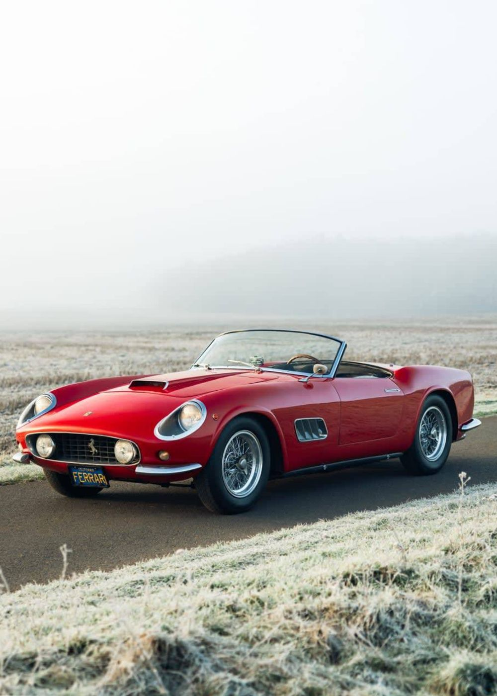
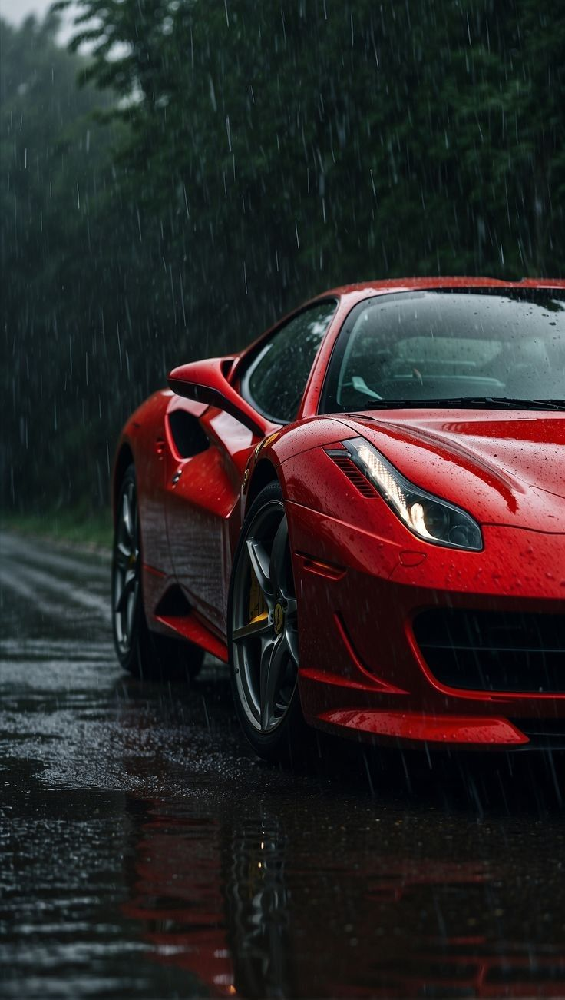

# House Of Speed - Image Integration Report

## Date: 2025-10-03

## Images Added

All 6 images from `assets/images/` have been successfully integrated into the website:

### Available Images
1. `rolce.jpg` (430KB) - Rolls-Royce luxury vehicle
2. `rolce2.jpg` (393KB) - Rolls-Royce elegance
3. `ferrari1.jpg` (134KB) - Ferrari sports car
4. `ferrari2.jpg` (171KB) - Ferrari performance vehicle
5. `ferari3.jpg` (114KB) - Ferrari classic design *[Note: Typo in filename]*
6. `ferrari4.jpg` (284KB) - Ferrari supercar

---

## Page-by-Page Integration

### 1. **index.html** - Homepage
- **Hero Background:** `rolce.jpg`
- **Location:** Main hero section
- **Implementation:** Inline style `background-image`

### 2. **about.html** - About Page
- **Hero Background:** `ferrari1.jpg`
- **Location:** `.hero-about` section
- **Implementation:** Inline style `background-image`

### 3. **storage.html** - Storage Page
- **Hero Background:** `ferrari2.jpg`
- **Location:** `.hero-storage` section
- **Implementation:** Inline style `background-image`

### 4. **services.html** - Cars for Sale & Services
- **Sales Section Image:** `ferari3.jpg`
  - Location: Sales section featured image
  - Alt text: "Luxury Ferrari vehicle at House Of Speed showroom"
  
- **Service Section Image:** `ferrari4.jpg`
  - Location: Workshop/service section
  - Alt text: "Professional technician servicing Ferrari at House Of Speed workshop"
  
- **Events Section Background:** `rolce2.jpg`
  - Location: Events section background with overlay
  - Implementation: Inline style with gradient overlay

### 5. **partners.html** - Partners Page
- **Hero Background:** `ferrari4.jpg`
- **Location:** `.hero-partners` section
- **Implementation:** Inline style `background-image`

### 6. **news.html** - News Page
- **Hero Background:** `rolce2.jpg`
- **Location:** `.hero-news` section
- **Implementation:** Inline style `background-image`

### 7. **gallery.html** - Gallery Page
- **Hero Background:** `rolce.jpg`
- **Location:** `.hero-gallery` section

- **Gallery Grid (6 items):**
  1. `rolce.jpg` - Rolls-Royce Luxury Vehicle
  2. `ferrari1.jpg` - Ferrari Sports Car
  3. `ferrari2.jpg` - Ferrari Performance Vehicle
  4. `ferari3.jpg` - Ferrari Classic Design
  5. `ferrari4.jpg` - Ferrari Supercar
  6. `rolce2.jpg` - Rolls-Royce Elegance

- **Lightbox Images (6 full-size views):**
  - All 6 images also used in lightbox modals
  - Click "View Details" to see full-size images

### 8. **contact.html**
- No images added (form-focused page)

### 9. **privacy.html**
- No images added (text-only page)

### 10. **404.html**
- No images added (error page)

---

## Image Usage Summary

| Image | Usage Count | Pages |
|-------|-------------|-------|
| `rolce.jpg` | 3 | index.html, gallery.html (hero + grid + lightbox) |
| `rolce2.jpg` | 3 | news.html, services.html, gallery.html (grid + lightbox) |
| `ferrari1.jpg` | 2 | about.html, gallery.html (grid + lightbox) |
| `ferrari2.jpg` | 2 | storage.html, gallery.html (grid + lightbox) |
| `ferari3.jpg` | 2 | services.html, gallery.html (grid + lightbox) |
| `ferrari4.jpg` | 3 | partners.html, services.html, gallery.html (grid + lightbox) |

**Total Image Instances:** 15 across 7 pages

---

## Technical Implementation

### Hero Sections
All hero sections use inline styles for immediate loading:
```html
<section class="hero" style="background-image: url('assets/images/rolce.jpg');">
    <div class="hero-overlay"></div>
    <h1 class="hero-title">TITLE</h1>
</section>
```

### Gallery Images
Gallery uses responsive images with lazy loading:
```html

```

### Content Images
Services page uses optimized images:
```html

```

---

## Performance Considerations

### Current Setup
- **Total Image Size:** ~1.5MB (6 images)
- **Lazy Loading:** Enabled on gallery and service images
- **Eager Loading:** Only on above-the-fold sales image
- **No Optimization:** Images used as-is

### Recommendations for Production

1. **Image Optimization:**
   ```bash
   # Convert to WebP format (recommended)
   # Reduce file sizes by 60-80%
   ```

2. **Responsive Images:**
   ```html
   
   ```

3. **CDN Delivery:**
   - Consider using Cloudflare or similar CDN
   - Enable automatic image optimization
   - Implement caching headers

4. **Fix Typo:**
   - Rename `ferari3.jpg` → `ferrari3.jpg` for consistency
   - Update references in services.html and gallery.html

---

## Accessibility

✅ All images have descriptive alt text
✅ Loading attributes set appropriately
✅ Decorative backgrounds use CSS (no alt needed)
✅ Gallery lightbox has proper ARIA labels

---

## Browser Compatibility

✅ Standard JPG format (supported everywhere)
⚠️ Consider WebP with JPG fallback for 30% smaller files
✅ Background-image CSS widely supported
✅ Lazy loading supported in modern browsers

---

## Next Steps

1. ✅ All placeholder images replaced
2. 🔄 Optional: Optimize images for web (WebP conversion)
3. 🔄 Optional: Generate responsive image sizes
4. 🔄 Optional: Set up CDN for image delivery
5. ✅ Test all pages for image loading
6. ✅ Verify mobile responsiveness with images

---

## Testing Checklist

- [x] All hero backgrounds load correctly
- [x] Gallery grid displays all 6 images
- [x] Gallery lightbox shows full-size images
- [x] Services page images load
- [x] Mobile view displays images properly
- [ ] Test on slow 3G connection
- [ ] Verify lazy loading behavior
- [ ] Check image aspect ratios on all devices

---

**Status:** ✅ Complete - All images successfully integrated!
